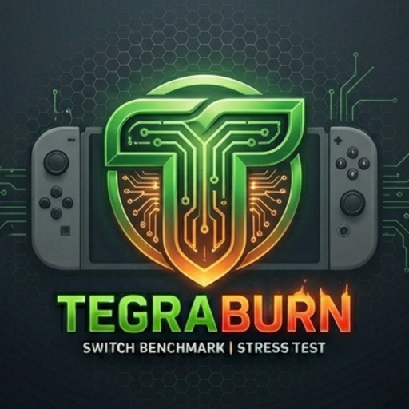
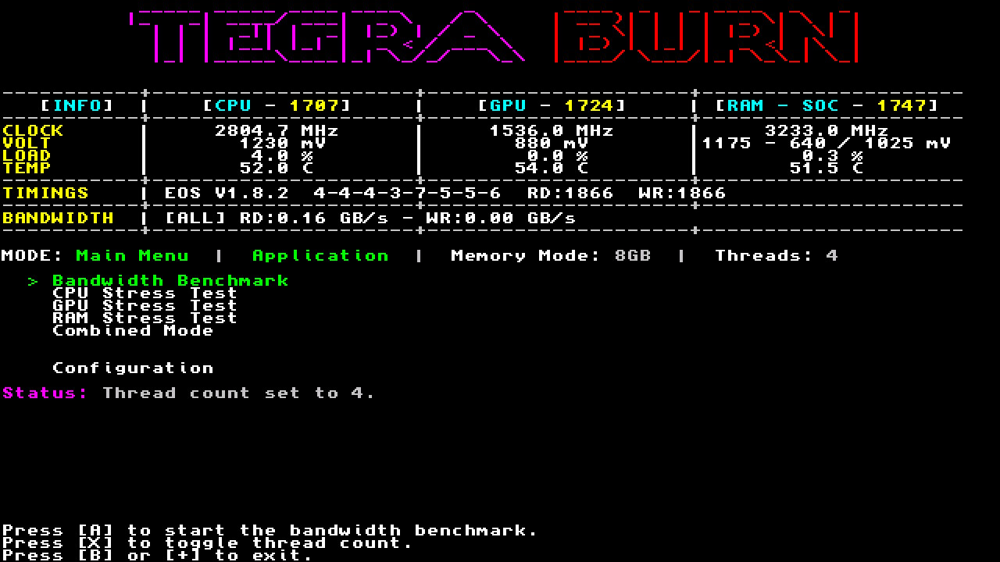
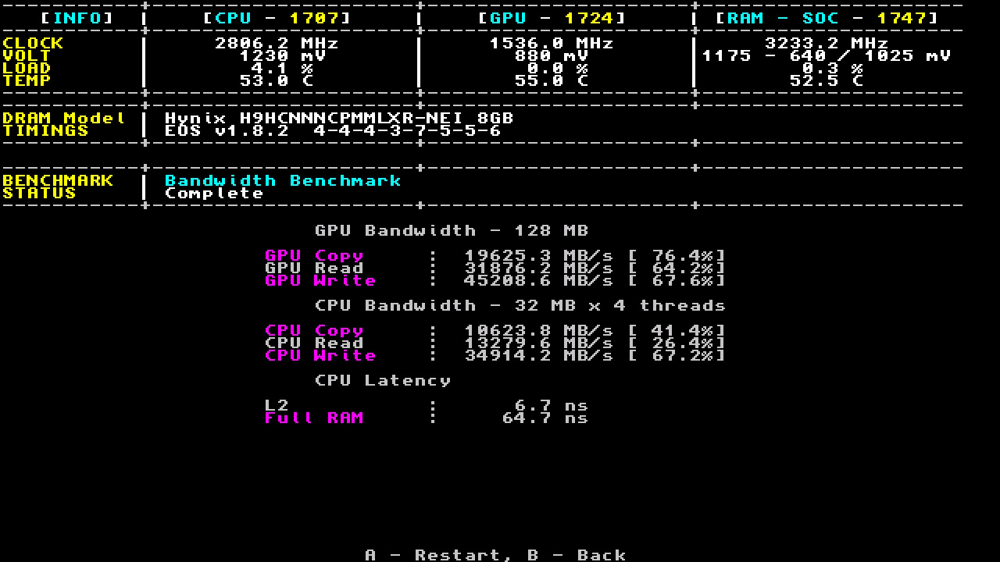
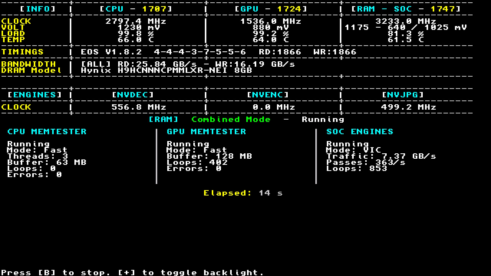

# <h1 align="center">TegraBurn</h1>
<p align="center">
  
</p>

<p align="center">
  Nintendo Switch homebrew for CPU, GPU, RAM and SoC benchmark/stress testing.
</p>

> [!WARNING]
> Stress tests, overclock / undervolt validation can cause crashes<br>
> Due to Horizon OS design instabilities from unsafe CPU/RAM clocks may cause filesystem corruption

## Features

| Category | Available Tests |
| --- | --- |
| Bandwidth Benchmark | CPU and GPU copy/read/write bandwidth, CPU latency results |
| CPU Stress Test | Stress-NX, CPU Path Tracer, Stress-NX Dynamic Cycler |
| GPU Stress Test | GPU Compute Stress, GPU Path Tracer, Furmark (48 Step), Dynamic GPU UV Tester |
| RAM Stress Test | Memtester CPU, Memtester GPU, Furmark CPU RAM Stress, Furmark GPU RAM Texture |
| Combined Mode | CPU + GPU Black Hole, RAM Combined Mode |

### Stress-NX Dynamic Cycler

Stress-NX Cycler validates CPU stability across a configurable CPU
frequency range using Stress-NX workloads

- Stress-NX - `hanoi w/ verify` workload
- Duration : Time spent at each frequency step
- Min/Max CPU Frequency : Lowest/Highest CPU frequency to test
- GPU Warm Up : Optionally run a basic GPU load alongside the CPU test to increase overall heat / power consumption
- GPU Frequency : GPU frequency used when GPU Warm Up is enabled

### GPU Compute Cycler
- GPU Compute Stress Test - deko3D
- Duration : Time spent at each frequency step
- Min/Max GPU Frequency : Lowest/Highest CPU frequency to test

### Combined RAM Stress

Combined Mode is designed to push memory traffic from several hardware blocks
at once :

- CPU: Memtester Fast / Full or Furmark RAM
- GPU: Memtester Fast / Full or Furmark Texture
- SoC: NVDEC, VIC or NVDEC + VIC
- multiple RAM-frequency testing with configurable minimum and maximum frequencies

Combined Mode is only available in application mode and requires 4 thread configuration

### Monitoring And Utilities

- Live CPU, GPU, RAM telemetry when provided by a compatible sys-clk setup
- DRAM model override selection (8GB)
- Results logging
- Built-in HBL 3/4T swapper
- Built-in forwarder installer

## Installation

1. Place `TegraBurn.nro` in:

   ```text
   sd:/switch/TegraBurn.nro
   ```

2. Launch TegraBurn from the Homebrew Menu
3. Open **Configuration** and select **Install Forwarder**
4. Launch TegraBurn through its installed forwarder for normal use

Do **not** create a TegraBurn forwarder through Sphaira or another generic
forwarder generator

The **HBL Thread Swapper** option can also enable 4 thread HB Menu
support, but it can cause issues for other homebrew applications. Restore the
default HBL after using this method

## Configuration And Logs

Configuration is stored on the SD card at:

```text
sd:/config/TegraBurn/config.ini
```

When results logging is enabled, reports are written to:

```text
sd:/config/TegraBurn/logs/bench.txt
sd:/config/TegraBurn/logs/cpu_stress.txt
sd:/config/TegraBurn/logs/ram.txt
```
## Screenshots
<p align="center">
  
  
</p>

<p align="center">
  
  
</p>


## Credits

- Lineon : Stress-NX / MembenchNX
- CTCaer : Memtester GPU
- [Anxietytimmy](https://github.com/Anxietytimmy) : Furmark-NX
